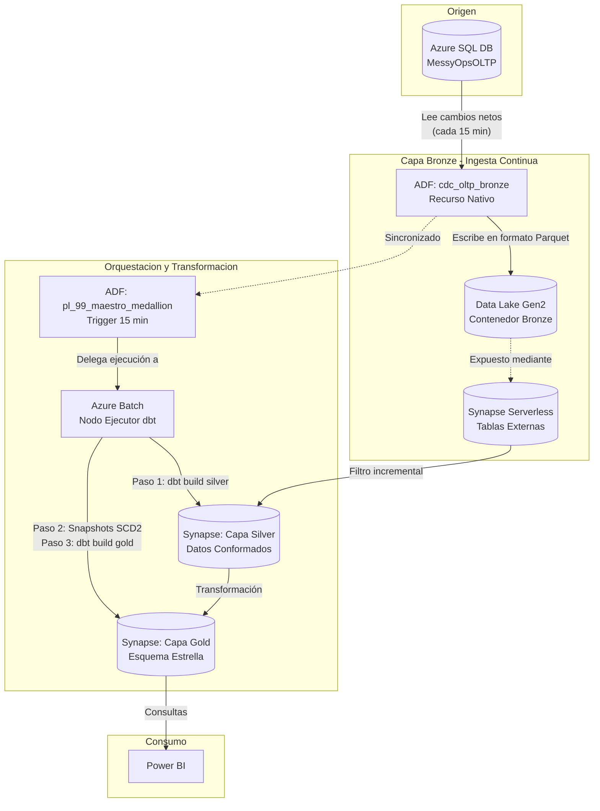

# Flujo Completo del Data Warehouse

Este documento describe la arquitectura de principio a fin (End-to-End) del proyecto MessyOps. 
El flujo se divide en dos grandes "motores" que corren en paralelo: la ingesta continua hacia la capa Bronze y la transformación orquestada hacia las capas Silver y Gold.

## Arquitectura y Flujo de Datos

### 1. Extracción (Capa Bronze)
El motor de Azure SQL registra todas las inserciones, actualizaciones y borrados. El recurso nativo de ADF (`cdc_oltp_bronze`) despierta cada 15 minutos, pide solo los cambios netos ocurridos y los guarda como archivos `.parquet` en Bronze. Azure Synapse expone estos archivos como tablas externas nativas.

### 2. Orquestación y Limpieza (Capa Silver)
Sincronizado con la llegada de datos, ADF lanza el pipeline maestro `pl_99_maestro_medallion`, el cual usa Azure Batch para levantar un entorno que ejecuta `dbt build` para Silver. Aquí se limpian nulos, se formatean textos y se recalcula el importe, procesando solo los datos nuevos mediante lógica incremental.

### 3. Modelado (Capa Gold)
Inmediatamente después, el maestro lanza `dbt snapshot` para resolver el versionado histórico (SCD Tipo 2) de clientes y productos. Finalmente, ejecuta `dbt build` para Gold, insertando las nuevas ventas en la tabla de hechos (`fact_ventas`) unidas a sus dimensiones actualizadas.

### 4. Consumo
Power BI se conecta de forma directa a las tablas y vistas de la capa Gold en Synapse, garantizando que el negocio consuma datos validados y frescos (con una latencia máxima de 15 a 30 minutos).
